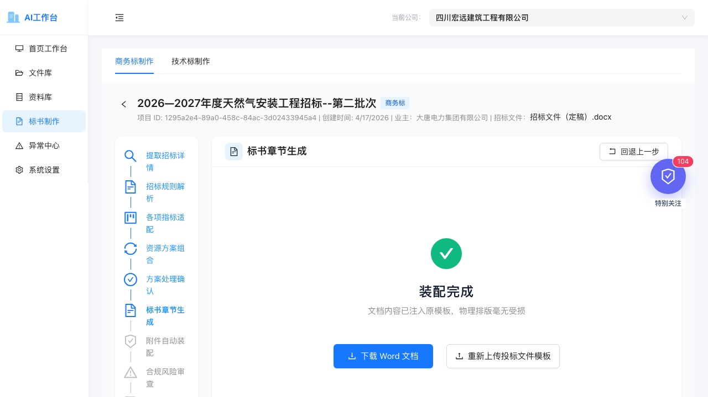
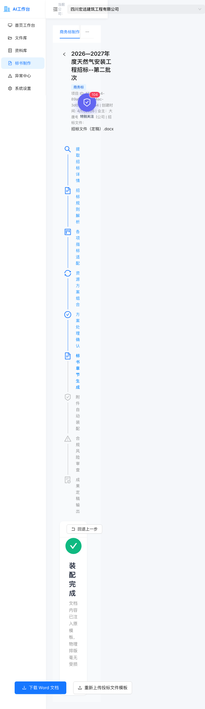
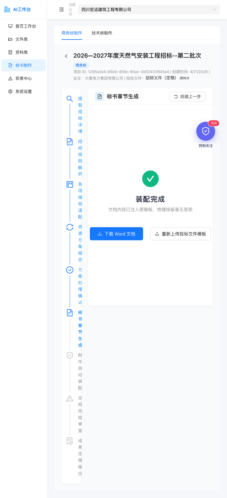
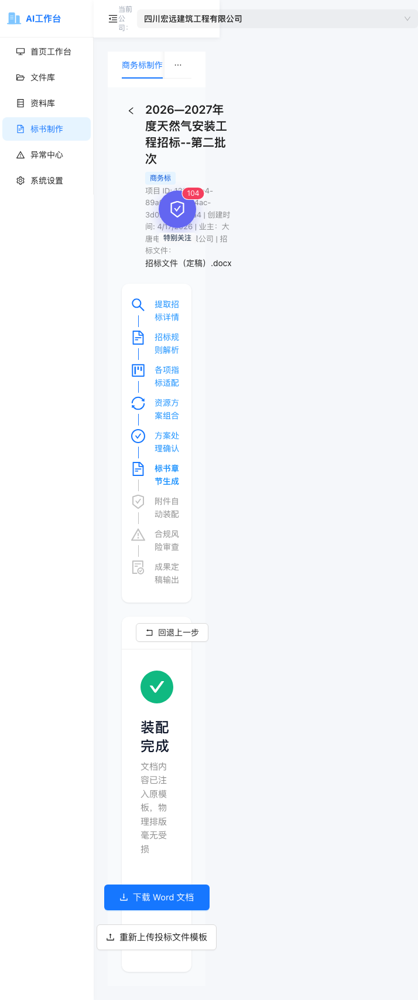
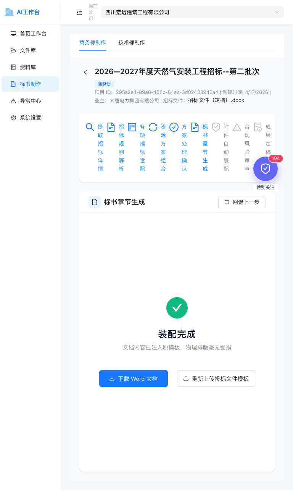
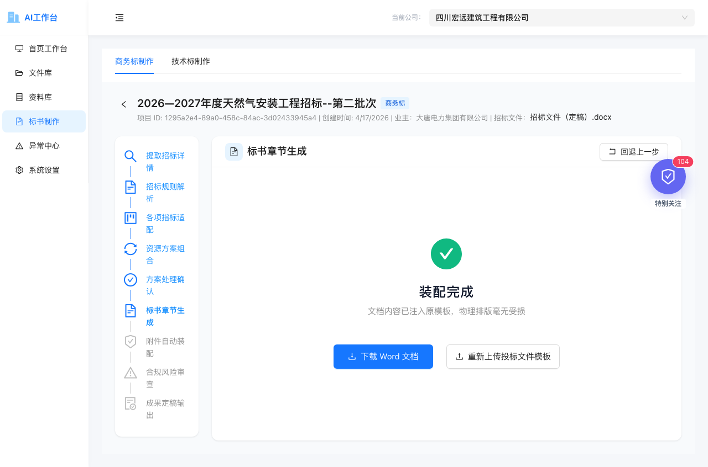

# 浏览器验证与截图日志

验证时间：2026-04-28  
项目页：`http://127.0.0.1:5173/bid-projects/1295a2e4-89a0-458c-84ac-3d02433945a4`  
验证目标：确认商务标 Step6 能完整生成 Word、刷新后保持成功态、下载入口可用、控制台无新错误，并记录响应式截图。

## 总结

| 验证项 | 工具 | 结果 |
| --- | --- | --- |
| 打开项目页 | browser-use:browser | 通过 |
| 点击“跳过，使用默认文件”触发 Step6 | browser-use:browser | 通过 |
| Step6 从生成态进入“装配完成” | browser-use:browser | 通过 |
| 点击“下载 Word 文档” | browser-use:browser | 通过 |
| 刷新后仍恢复“装配完成” | browser-use:browser | 通过 |
| 刷新后下载链接仍存在 | browser-use:browser | 通过 |
| fresh console warning/error | browser-use:browser | 0 条 |
| gstack browse 本地浏览器启动 | gstack browse | 通过 |
| 页面文本包含“装配完成” | gstack browse | 通过 |
| 页面文本包含“下载 Word 文档” | gstack browse | 通过 |
| 下载链接出现在页面 links 中 | gstack browse | 通过 |
| console --errors | gstack browse | no console errors |
| desktop 截图 | gstack browse | 已保存 |
| mobile/tablet/desktop 响应式截图 | gstack browse | 已保存 |
| 窄屏步骤栏挤压问题 | gstack browse 截图发现 | 已修复并复验 |

## browser-use:browser 测试记录

### 1. 打开项目页

```text
URL: http://127.0.0.1:5173/bid-projects/1295a2e4-89a0-458c-84ac-3d02433945a4
Title: 建筑工程投标资料工作台
结果：页面加载成功
```

### 2. 触发 Step6 默认模板生成

操作：

```text
点击“跳过，使用默认文件”
```

观察：

```text
页面进入“Eino Agent 正在协同装配标书”
随后进入“装配完成”
```

说明：

第一次短等待时还在生成动画中，因此继续轮询页面状态；最终 DOM 显示：

```text
heading "装配完成"
button/link "下载 Word 文档"
button "重新上传投标文件模板"
```

### 3. 下载按钮验证

操作：

```text
点击“下载 Word 文档”
```

结果：

```text
下载操作可触发，页面仍停留在项目工作台，不发生错误跳转。
```

### 4. 刷新恢复成功态

刷新前发现的问题：

```text
生成成功后页面显示“装配完成”，但刷新后又回到“请上传专属的投标文件模板”。
```

修复后 browser-use 复验结果：

```text
restoreDoneCount = 1
restorePromptCount = 0
fresh console warning/error = []
```

刷新后 DOM 关键片段：

```text
heading "装配完成"
link "download 下载 Word 文档"
href: /api/bid-projects/1295a2e4-89a0-458c-84ac-3d02433945a4/step6/download?file=export_1295a2e4-89a0-458c-84ac-3d02433945a4_20260428020745.docx
```

### 5. 下载接口验证

```text
HEAD /api/bid-projects/:id/step6/download?file=export_1295a2e4-89a0-458c-84ac-3d02433945a4_20260428020745.docx
=> HTTP/1.1 200 OK
=> Content-Type: application/vnd.openxmlformats-officedocument.wordprocessingml.document
=> Content-Length: 46313
```

### 6. 输出记录验证

```text
output_type=commerce_word
status=available
file_name=export_1295a2e4-89a0-458c-84ac-3d02433945a4_20260428020745.docx
file_path=data/exports/bid_projects/1295a2e4-89a0-458c-84ac-3d02433945a4/export_1295a2e4-89a0-458c-84ac-3d02433945a4_20260428020745.docx
```

### 7. DOCX 内容验证

导出文件：

```text
backend_go/data/exports/bid_projects/1295a2e4-89a0-458c-84ac-3d02433945a4/export_1295a2e4-89a0-458c-84ac-3d02433945a4_20260428020745.docx
size: 45K
```

`word/document.xml` 可检索到：

```text
自动装配资料
四川宏远建筑工程有限公司
汇亮新能源开鲁10MW
```

## gstack browse 测试记录

### 1. 工具环境修复

最初问题：

```text
gstack browse 启动失败：
FATAL: Chromium process crashed or was killed. Server exiting.
```

定位：

```text
~/Library/Caches/ms-playwright 缺完整 chromium-1208 缓存，只剩 headless shell 或不完整目录。
```

修复：

```text
bunx playwright install chromium
```

最终缓存：

```text
Chrome for Testing 145.0.7632.6 -> ~/Library/Caches/ms-playwright/chromium-1208
Chrome Headless Shell 145.0.7632.6 -> ~/Library/Caches/ms-playwright/chromium_headless_shell-1208
FFmpeg -> ~/Library/Caches/ms-playwright/ffmpeg_mac12_special-1010
```

验证：

```text
browse status
=> Status: healthy
=> Mode: launched
```

### 2. 页面状态验证

命令结果：

```text
browse goto http://127.0.0.1:5173/bid-projects/1295a2e4-89a0-458c-84ac-3d02433945a4
=> Navigated ... (200)

wait text=装配完成
=> Element text=装配完成 appeared

document.body.textContent.includes("装配完成")
=> true

document.body.textContent.includes("下载 Word 文档")
=> true
```

### 3. 下载链接验证

```text
links
=> 下载 Word 文档 → http://127.0.0.1:5173/api/bid-projects/1295a2e4-89a0-458c-84ac-3d02433945a4/step6/download?file=export_1295a2e4-89a0-458c-84ac-3d02433945a4_20260428020745.docx
```

### 4. 控制台验证

```text
console --errors
=> no console errors
```

### 5. 截图：桌面成功态

文件：

```text
docs/browser-validation-screenshots/2026-04-28-step6-gstack-desktop.png
size: 97K
dimensions: 1280x720
```



## 响应式截图记录

### 修复前：gstack browse 发现窄屏挤压

问题：

```text
mobile 下步骤栏和内容区仍左右分栏，导致步骤文字逐字竖排，主体卡片过窄。
tablet 下也有类似拥挤。
desktop 正常。
```

#### Before Mobile

文件：

```text
docs/browser-validation-screenshots/2026-04-28-step6-responsive-before-mobile.png
dimensions: 714x2470
```



#### Before Tablet

文件：

```text
docs/browser-validation-screenshots/2026-04-28-step6-responsive-before-tablet.png
dimensions: 768x1677
```



#### Before Desktop

文件：

```text
docs/browser-validation-screenshots/2026-04-28-step6-responsive-before-desktop.png
dimensions: 1280x846
```


### 修复后：步骤区与内容区上下排列，按钮允许换行

修复内容：

```text
BidProjectWorkbench / TechBidProjectWorkbench:
Row gutter={24} -> gutter={[24, 24]}
步骤栏 Col 固定 span -> xs={24} lg={...}
主内容 Col 固定 span -> xs={24} lg={...}
Steps orientation 根据 lg 断点切换 horizontal/vertical

CommerceChapterGenerationPanel:
下载/上传按钮 Space 增加 wrap
```

#### After Mobile

文件：

```text
docs/browser-validation-screenshots/2026-04-28-step6-responsive-after-mobile.png
dimensions: 714x1706
```



#### After Tablet

文件：

```text
docs/browser-validation-screenshots/2026-04-28-step6-responsive-after-tablet.png
dimensions: 768x1283
```



#### After Desktop

文件：

```text
docs/browser-validation-screenshots/2026-04-28-step6-responsive-after-desktop.png
dimensions: 1280x846
```



## 最终判定

```text
browser-use:browser 验证：通过
gstack browse 验证：通过
Step6 生成态 -> 装配完成：通过
刷新恢复成功态：通过
下载链接存在：通过
下载接口 HEAD 200：通过
DOCX 内容可检索：通过
fresh console warning/error：0
响应式截图：已保存，窄屏挤压已修正
```

结论：商务标 Step6 的浏览器验证链路已整理完毕，截图证据已固化到 `docs/browser-validation-screenshots/`。
